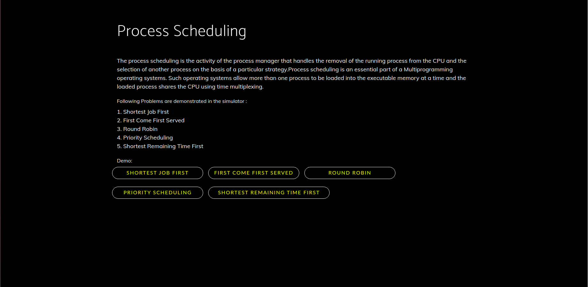

# OS-Simulator

This is an application built using Vanilla JS, HTML and CSS which simulates the Operating Systems Concepts.
The password for the login screen is "OSsimulator".

### Steps to Run

```
1. Unzip the package

2. Open index.html using browser
```

### Screenshots





### Team

1. Tejas Gowda
2. Vaibhav Agrawal
3. Vaishali D S
4. Yojana Mallik
5. Samar Sodhi
6. Vidit Harin Shah
7. Y Supradha Bhat
8. Violina Doley
9. Umika Saroha
10. Vinay H
11. Yash Manoj Goyal
12. Abhinav R
13. Sushant Kumar
14. Tejaswini B S
15. Thaker Harsh Linesh